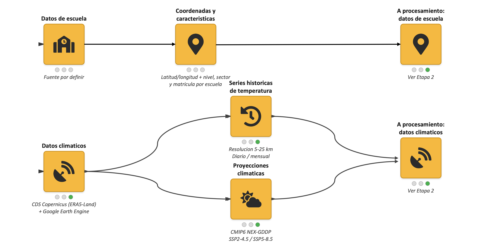
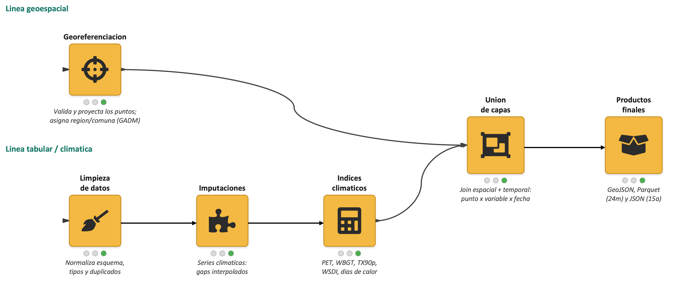
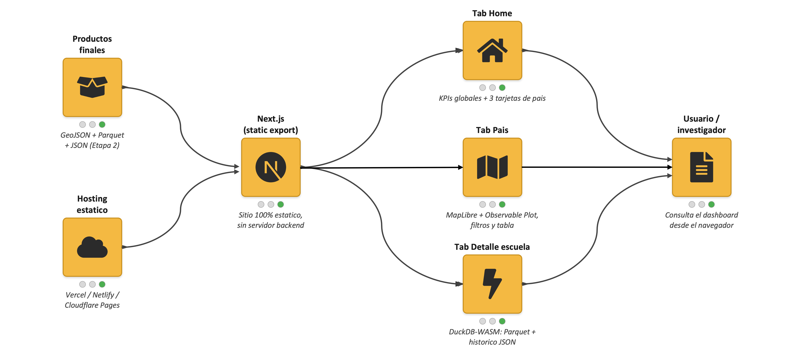

# HeatSchools Dashboard

Visualizador de datos del proyecto **HeatSchools** (Wellcome Climate Impacts Award): exposición al calor extremo en escuelas de Chile, Colombia y Perú.

> **Datos de preliminares:** se agregan datos georefereciados de escuelas. Sin embargo, los datos de temperatura siguen siendo simulaciones. 

## Infraestructura

| Capa | Descripción |
|------|-------------|
| **Pipeline** (`pipeline/`) | Python + DuckDB para procesamiento de datos climáticos y exportación a GeoJSON, Parquet e históricos JSON |
| **Datos** (`site/public/data/`) | Artefactos estáticos servidos al navegador (mockup versionado en git; en producción irán a un bucket de objetos) |
| **Sitio** (`site/`) | Dashboard estático (Next.js export) desplegable en Cloudflare Workers, GitHub Pages, Netlify o Vercel |
| **CI/CD** (`.github/workflows/`) | GitHub Actions para actualización automática del pipeline (placeholder hasta conectar fuentes reales) |

## Tecnología

- **Frontend:** Next.js 15 (static export), React 19, TypeScript
- **Mapas:** MapLibre GL JS (WebGL, clustering)
- **Gráficos y tablas:** Observable Plot
- **Consultas en navegador:** DuckDB-WASM + httpfs (Parquet vía HTTP Range Requests)
- **Pipeline (mockup):** Python 3.10+, pandas, pyarrow
- **Despliegue objetivo:** sitio 100 % estático en CDN + datos en almacenamiento de objetos

## Flujo de datos (tres etapas)

El proyecto conecta fuentes geoespaciales y climáticas con un visualizador estático en tres pasos. Los diagramas están en `site/public/images/pipeline/`.

### Etapa 1: Adquisición



Dos líneas de datos convergen hacia el procesamiento:

| Línea | Fuente | Contenido |
|-------|--------|-----------|
| **Escuelas** | Por definir (según país) | Coordenadas, nivel, sector y matrícula por establecimiento |
| **Clima** | Copernicus CDS (ERA5-Land) + Google Earth Engine | Series históricas de temperatura (5-25 km, diaria/mensual) y proyecciones CMIP6 NEX-GDDP (SSP2-4.5, SSP5-8.5) |

### Etapa 2: Procesamiento



| Línea | Pasos | Salida |
|-------|-------|--------|
| **Geoespacial** | Georeferenciación: validación, proyección y asignación región/comuna (GADM) | Puntos escolares normalizados |
| **Tabular / climática** | Limpieza de esquema → imputación de gaps → índices (PET, WBGT, TX90p, WSDI, días de calor) | Series e indicadores por escuela |
| **Unión** | Join espacial + temporal (punto × variable × fecha) | **GeoJSON**, **Parquet** (24 meses), **JSON** (15 años) |

Pipeline implementado en `pipeline/` con Python, pandas, pyarrow y DuckDB.

### Etapa 3: Visualización



| Componente | Tecnología | Función |
|------------|------------|---------|
| **Hosting** | Cloudflare Workers (assets estáticos), GitHub Pages, Vercel o Netlify | Sitio 100 % estático, sin backend |
| **Framework** | Next.js (static export) | Build del dashboard |
| **Home** | KPIs + tarjetas por país | Panorama regional |
| **País** | MapLibre GL JS + Observable Plot | Mapas, gráficos, filtros y tabla |
| **Detalle escuela** | DuckDB-WASM | Consulta Parquet e históricos JSON en el navegador |

## Estructura del repositorio

```
HeatSchoolsDash/
├── pipeline/              # Scripts Python (generación y futuro procesamiento)
│   ├── simulate_data.py   # Datos artificiales de demostración
│   ├── schema.py          # Esquema compartido pipeline ↔ frontend
│   ├── requirements.txt
│   └── tests/
├── site/                  # Aplicación Next.js
│   ├── public/
│   │   ├── data/          # GeoJSON, Parquet, JSON históricos
│   │   └── images/
│   │       └── pipeline/  # Diagramas del flujo de datos (3 etapas)
│   ├── wrangler.toml      # Deploy Cloudflare Workers (assets estáticos → out/)
│   └── src/
├── scripts/               # Atajos para desarrollo local
└── .github/workflows/
```

## Requisitos

- **Node.js 18+** (dashboard)
- **Python 3.10+** (regenerar datos simulados, opcional)

## Cómo correr el dashboard

### Desarrollo (recomendado)

```bash
./scripts/run-dev.sh
```

Abre [http://localhost:3000](http://localhost:3000).

### Vista de producción local

```bash
./scripts/run-preview.sh
```

Compila el export estático (`site/out/`) y lo sirve en el puerto 3000.

### Manual

```bash
cd site
npm install
npm run dev          # desarrollo
npm run build        # genera site/out/
npx serve out -p 3000  # preview estático
```

### Regenerar datos simulados (opcional)

```bash
cd pipeline
pip install -r requirements.txt
python simulate_data.py
pytest tests/
```

## Despliegue en Cloudflare Workers

El sitio usa **export estático** (`output: "export"`) y se publica como **assets estáticos** de un Worker, sin OpenNext ni SSR.

### Configuración en el dashboard (Workers & Pages → Settings → Build)

| Campo | Valor |
|-------|--------|
| **Root directory** | `site` (sin barra inicial; **no** `/site`) |
| **Build command** | `npm ci && npm run build` |
| **Deploy command** | `npx wrangler deploy` |
| **Branch (producción)** | `main` |

Variable de entorno requerida: `NODE_VERSION` = `22` (Wrangler 4.x exige Node ≥ 22).

#### Si el deploy falla con “Could not detect a directory containing static files”

Ese error indica que Wrangler se ejecutó **fuera** de `site/` (no encontró `wrangler.toml` ni la carpeta `out/`). Suele deberse a:

1. **Root directory mal escrito** — debe ser `site`, no `/site`.
2. **Build no ejecutado** — el log debe mostrar `npm run build` antes de `wrangler deploy`.
3. **Node demasiado antiguo** — Wrangler 4.x requiere Node ≥ 22; configura `NODE_VERSION=22` en Settings → Variables.

Tras corregir, usa **Retry deployment** o haz un push vacío a `main`.

El archivo `site/wrangler.toml` define el Worker (`mockup-hsd`) y apunta a la carpeta `out/` generada por `next build`. Wrangler no debe auto-detectar OpenNext: la config explícita evita ese camino.

### Deploy local (opcional)

Requiere [Wrangler](https://developers.cloudflare.com/workers/wrangler/) autenticado (`npx wrangler login`):

```bash
cd site
npm install
npm run deploy
```

Preview local del Worker con los assets compilados:

```bash
cd site
npm run preview:worker
```

### Producción (futuro)

1. GitHub Actions ejecuta el pipeline y publica datos a Cloudflare R2 (u otro bucket).
2. El sitio estático apunta a URLs del bucket para Parquet y GeoJSON.
3. Cloudflare Workers sirve la carpeta `out/` generada por `next build` (vía `wrangler deploy`).

## Licencia

MIT. Ver [LICENSE](LICENSE).
